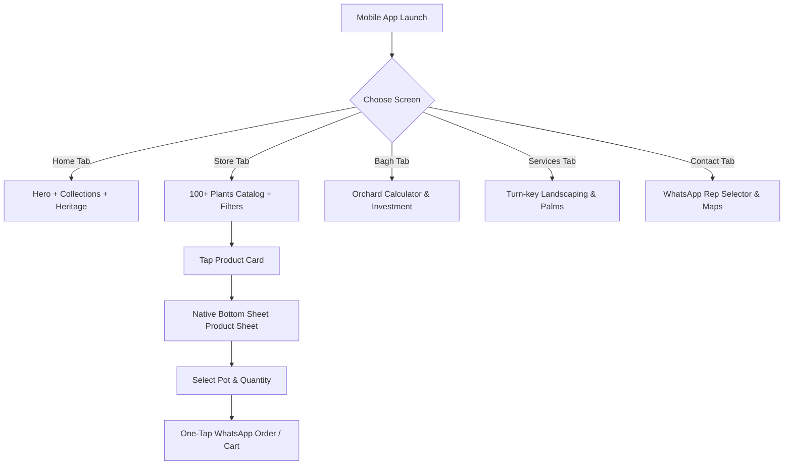

# 🌿 Rahman Nursery Farm — Official Enterprise E-Commerce & Native Mobile App Blueprint

> **Pakistan's Premier 50+ Years Botanical Heritage, Commercial Orchard Packages & Certified Plant E-Commerce Engine.**
> 
> *Location: Chak Hassan Arain, Arifwala, Punjab, Pakistan*  
> *Official Helplines: Ansar Hussain (0304-0450065) | Bashart Saleem (0344-5155160) | Kashir Saleem (0304-1001600)*

---

## 📌 Executive Summary & Project Purpose

**Rahman Nursery Farm** is an enterprise-grade React e-commerce application engineered with an ultra-responsive, **Mobile Native App UI/UX Architecture**. Built upon a 50+ year family legacy established by the founder **Muhammad Shareef (Late) — Baba Shareef**, this platform connects commercial fruit orchard developers, luxury villa owners, and plant enthusiasts directly to certified growers in Chak Hassan Arain without middleman markups.

This document serves as both the **Source Code Documentation** and the **Official Product Requirements Document (PRD) / Native Mobile App Architectural Blueprint** for porting or extending this platform into iOS (Swift/SwiftUI), Android (Kotlin/Jetpack Compose), React Native, or Flutter mobile applications.

---

## 🎯 Core Features & System Modules

### 1. 🛍️ Certified Botanical Storefront (`ShopPage.jsx`)
- **100+ Grafted & Acclimatized Plants**: Chaunsa Mango, China Guava, Royal Date Palms, Pink Cassia Nodosa, Monstera Deliciosa, Fine Zoysia Turf Grass, and more.
- **Dynamic Category & Difficulty Filtering**: Filter by category (`orchard`, `fruit`, `palms`, `indoor`, `outdoor`, `flowering`, `bonsai`, `medicinal`) and care levels (`Easy`, `Moderate`, `Advanced`).
- **Dual View Modes**: Seamless toggle between High-Visual 2-Column Grid and Fast-List View.
- **Real-Time Search Engine**: Navbar global search integrated with local catalog indexing.

### 2. 🧮 Interactive Orchard Cost & Yield Estimator (`BaghPackagesPage.jsx`)
- **Commercial Land Calculator**: Range slider dynamically calculates required saplings, total investment, harvest timeline, and annual revenue projections based on land acreage (1 to 20+ Acres / 8 to 160+ Kanals).
- **Fruit Specs Engine**: Preset formulas for Multani Chaunsa Mango, High-Density China Guava, Packaged Kinnu Citrus, Kandhari Anar, and Royal Date Palms.
- **Direct Turn-Key Booking**: One-tap WhatsApp booking formatted with exact acreage calculations.

### 3. 🔍 Mobile Native Product Inspector Sheet (`PlantInspectorModal.jsx`)
- **Sticky App Top Bar**: Native back control, plant title, and unit price badge.
- **Planter Container Customizer**: Dynamic pot selector (`Terracotta`, `Ceramic White`, `Fiberglass`, `Grow Bag`) updating total order price.
- **Botanical Care & Benefits Matrix**:
  - **NASA Air Score & Dust Filter Percentage**
  - **Health & Wellness Benefits** (Oxygen output, Ayurvedic immunity, stress reduction)
  - **Ecological Impact** (Urban heat reduction by 3-5°C, soil erosion control, honeybee habitat)
- **Growth & Maturity Timeline**: Interactive age simulator (`1 Year`, `2 Years`, `3+ Years`).
- **Sticky Mobile Bottom Action Bar**: Quantity counter (`- 1 +`), Cart integration, and Direct WhatsApp Order button.

### 4. 📲 Multi-Representative WhatsApp Order Router (`WhatsAppSelectorModal.jsx`)
Applies strict business hierarchy and automatic message routing:
1. **Ansar Hussain** (`03040450065`) — *Online Sales & Nationwide Cargo Manager* `[TOP REPRESENTATIVE]`
2. **Bashart Saleem** (`03445155160`) — *Main Nursery Lead & Physical Branch Manager (Qaboola)*
3. **Kashir Saleem** (`03041001600`) — *Pakpattan Road Branch Manager (Ada 17)*

### 5. 📜 50+ Years Family & Farm Heritage (`FamilyHeritagSection.jsx`)
- Honors founder **Muhammad Shareef (Late) — Baba Shareef** (Nursery founder & traditional *Haddi Jorne Wala* bone-setter).
- Profiles sons **Muhammad Saleem**, **Muhammad Rafiq**, and **Abdul Hameed**.
- Showcases next generation leaders including **Bashart Saleem**, **Ansar Hussain**, **Kashir Saleem**, and **Muhammad Kashif** (*Principal Engineer at Adaxiom Organization*).

### 6. ⭐ Verified Client Testimonials Marquee (`ReviewsSection.jsx`)
- Smooth infinite marquee showcasing real client reviews from DHA Lahore, Bahria Islamabad, Multan Agro Estates, and Karachi Oceanfront Penthouses.
- Interactive hover-to-pause and verified badges.

---

## 🎨 Design System & UI/UX Guidelines

To maintain the premium luxury aesthetic across both Web and Mobile Apps, adhere strictly to the following design tokens:

### Color Palette

| Token Name | Hex Code | Purpose |
|------------|----------|---------|
| **Deep Forest Green** | `#14532d` / `#166534` | Primary Brand Accent, Headers, Primary Buttons |
| **Warm Gold / Amber** | `#F59E0B` / `#D97706` | Badges, Highlights, Price Indicators, Ratings |
| **Clean Cream Background** | `#F7F8F5` | Main Background Surface |
| **Dark Slate / Night** | `#111827` / `#030712` | High-Contrast Containers, Footers, Modals |
| **WhatsApp Emerald** | `#15803d` / `#16a34a` | Direct Order CTA Buttons |

### Typography

- **Headings & Titles**: `Playfair Display` (Serif, Bold/Black 800-900)
- **Body & Controls**: `Inter` / `Plus Jakarta Sans` (Sans-Serif, Medium 500 to Black 900)

### Touch & Mobile Principles
- **Minimum Touch Target**: `48px` width/height for all buttons and inputs.
- **iOS Safe Areas**: Enforce `padding-bottom: env(safe-area-inset-bottom)` and `padding-top: env(safe-area-inset-top)` on sticky elements.
- **Anti-Zoom**: Set base `font-size: 16px` on inputs to prevent forced browser zoom on iOS.

---

## 📱 Mobile App Conversion & Native Development Blueprint

When building native mobile apps for **Rahman Nursery Farm** (using **React Native**, **Flutter**, **Kotlin Jetpack Compose**, or **SwiftUI**), follow this implementation roadmap:



### Proposed Native App Features
1. **Push Notifications**: Instant alerts for seasonal plant availability (e.g., *Fruit Grafting Season*, *Cassia Nodosa Bloom*).
2. **Offline Caching**: Store catalog locally using SQLite / Realm / AsyncStore for instant loading in low-connectivity farm areas.
3. **Camera AR Plant Preview**: Allow users to place 3D/AR models of Royal Date Palms and Monstera plants in their villa gardens using ARKit / ARCore.
4. **Geo-Location Farm Routing**: GPS navigation to Qaboola Main Nursery, Pakpattan Rd Ada 17, and Chak Hassan Arain fields.

---

## 📁 Repository Structure

```
rahman-nursery-farm/
├── public/
│   ├── logo.png                # Official transparent cropped brand logo
│   └── favicon.ico
├── src/
│   ├── components/
│   │   └── ui/
│   │       ├── Navbar.jsx                  # Desktop top navigation bar
│   │       ├── MobileTopBar.jsx            # Mobile app top bar + drawer menu
│   │       ├── MobileBottomNav.jsx         # Mobile 5-tab bottom navigation bar
│   │       ├── HeroOverlay.jsx             # Hero banner & primary CTAs
│   │       ├── ShopPage.jsx                # Full e-commerce plant catalog & filters
│   │       ├── BaghPackagesPage.jsx        # Commercial orchard investment calculator
│   │       ├── ServicesPage.jsx            # Villa landscaping & palm transplanting
│   │       ├── PlantInspectorModal.jsx     # Mobile native product details sheet
│   │       ├── WhatsAppSelectorModal.jsx   # Multi-rep WhatsApp order router
│   │       ├── FamilyHeritagSection.jsx    # About Us & 50+ Yrs family story
│   │       ├── ReviewsSection.jsx          # Infinite client testimonials marquee
│   │       ├── StorySections.jsx           # Featured botanical collections
│   │       ├── CartDrawer.jsx              # Sliding shopping cart & order form
│   │       ├── ContactPage.jsx             # Farm locations & contact form
│   │       └── Footer.jsx                  # Desktop footer & quick links
│   ├── data/
│   │   └── plantCatalog.js             # 100+ plant specifications & prices
│   ├── utils/
│   │   └── whatsappHelper.js           # Formatted WhatsApp link generator
│   ├── App.jsx                         # Main application state & tab routing
│   ├── main.jsx                        # React entry point
│   └── index.css                       # Global Tailwind CSS & mobile design system
├── package.json
├── vite.config.js
└── README.md
```

---

## 🛠️ Local Development & Deployment

### Prerequisites
- **Node.js**: v18.0.0 or higher
- **npm**: v9.0.0 or higher

### Installation

```bash
# Clone the repository
git clone https://github.com/ali128664-hue/rahman-nursery-farm.git

# Navigate to project directory
cd rahman-nursery-farm

# Install dependencies
npm install

# Start local development server
npm run dev
```

### Production Build

```bash
# Build minified production bundle
npm run build

# Preview production build locally
npm run preview
```

---

## 🤝 Business Contact & Technical Support

- **Online Sales & Cargo Helpline**: Ansar Hussain — `+92 304 0450065`
- **Main Nursery Lead**: Bashart Saleem — `+92 344 5155160`
- **Pakpattan Road Branch**: Kashir Saleem — `+92 304 1001600`
- **Technical Architecture**: Muhammad Kashif (*Principal Engineer — Adaxiom Organization*)

---
*© 2025 Rahman Nursery Farm. All rights reserved.*
